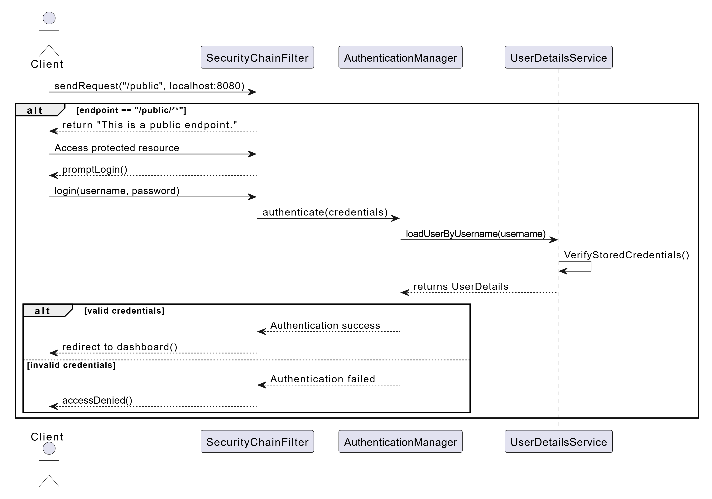
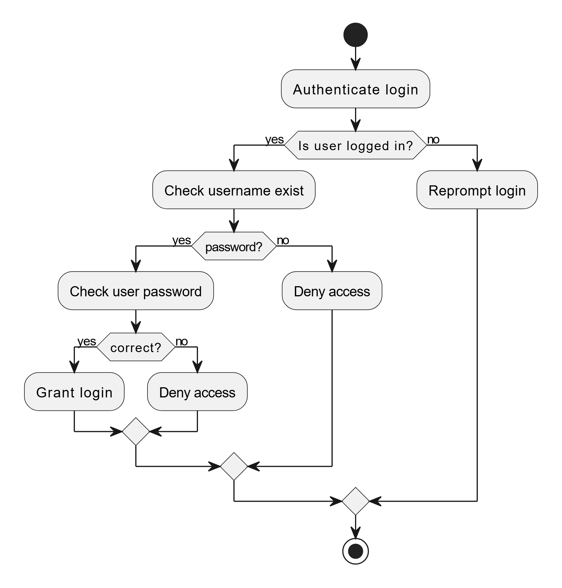
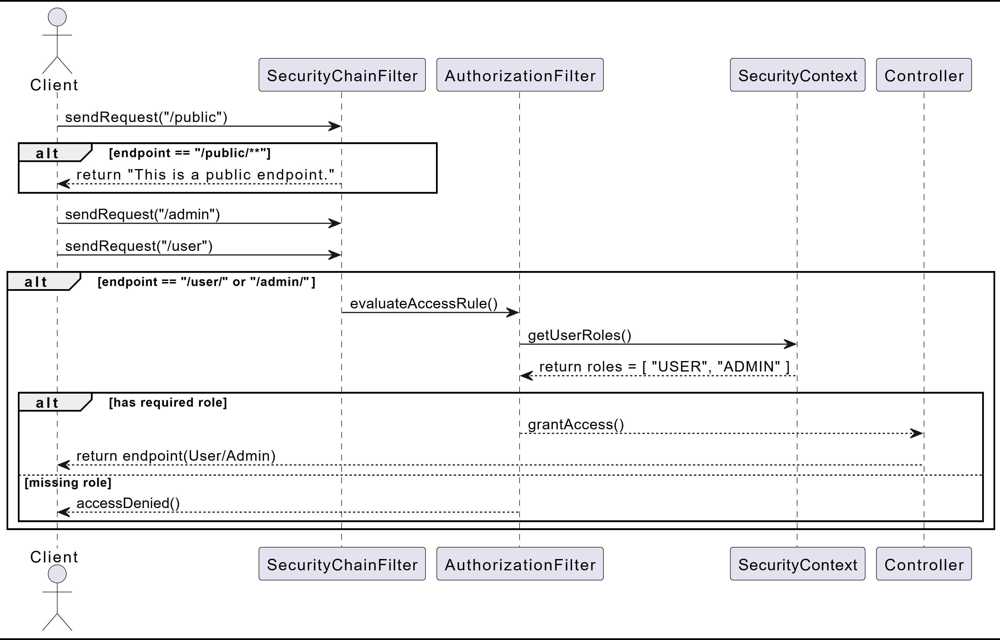
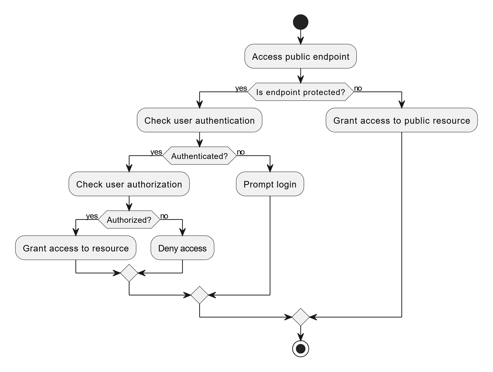

# swen-755-group-6-authentication-authorization

## Prerequisites: 

### Have an CLI or IDE (IntelliJ) installed and launched

## How to run code: 
Git clone https://github.com/rtyocum/swen-755-group-6-authentication-authorization.git
Run Java AuthorizationApplication.java ( CLI or IDE)
Open a browser, head to localhost:8080

## Frameworks & Libraries used:
### Spring Framework
### Spring Boot
### Spring Web
### Spring Security

# Authentication 
The following documentation showcases the validation and verifcation of an actor's identity..

### Sequence diagram:

### Acitviity diagram:

# Authorization
Assumptions: The user is already logged in or a public user, the only concern here is what they are allowed to access. Therefore, the diagrams will not include the act of logging in.

### Sequence Diagram:

### Acivity diagram:

This diagram is verifying that the user properly has access to the resource by verifying the role they claim to be.
